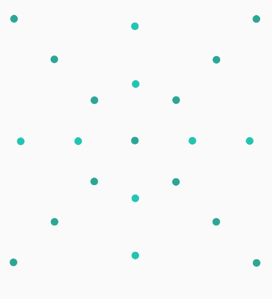

# Grav
[ ](https://bintray.com/glomadrian/maven/Grav/_latestVersion)
[](http://www.apache.org/licenses/LICENSE-2.0) [](http://developer.android.com/index.html)

<p align="center">

</br>
</center>
<p>
Grav is a library for android which allow you to make multiple animations based
on points.
<p/>

<p align="center">


<p/>

# How to use it

The library is composed of generators, each generator takes care of one thing.
Composing different generators you can obtain different results.

There are different kind of generators:

 - Point generator
 - Grav generator
 - Color generator
 - Animation generator


## Point generator
The point generator is the class that creates the locations of the points that will be drawn using a Grav Generator.
 In order to use it you need to set the attribute:
```java
app:pointGenerator="classname"
```
The first thing you need is a Point generator, the are 3 generators available:

### Regular point generator

Generate points based on a cell and a variance.
```java
app:pointGenerator="com.github.glomadrian.grav.generator.point.RegularPointGenerator"
app:regular_cell_size="200"
app:regular_variance="20"
```
(Using in combination with GravBallGeneartor)


### Circular point generator

Generate points based on a cell and a variance in a circular shape.
```java
app:pointGenerator="com.github.glomadrian.grav.generator.point.CircularPointGenerator"
app:regular_cell_size="200"
app:regular_variance="200"
```

(Using in combination with GravBallGeneartor)



### Percent point generator
Generate the points based on percent locations array.
```java
app:pointGenerator="com.github.glomadrian.grav.generator.point.PercentPointGenerator"
app:percent_points_array="@array/walla_points_percent_points"
```
Inside arrays.xml each pair of items represents a point in the view, which is defined by a width percent and a height percent.
```java
<integer-array name="sample_points_percent_points">
   <item>10</item>
   <item>60</item>

   <item>8</item>
   <item>30</item>

   <item>25</item>
   <item>10</item>
 </integer-array>
```
(Using in combination with GravBallGeneartor)


## Grav Generator

Grav generator is the piece in charge of draw every point previously generated.
To use you need to set the attribute:
```java
app:gravGenerator="classname"
```
There are two Grav Generator available


### Ball generator

Draws a ball.

Ball sizes can be generated randomly within a range using the following attributes:

```java
app:gravGenerator="com.github.glomadrian.grav.generator.grav.BallGenerator"
app:ball_from_size="3dp"
app:ball_to_size="16dp"
```


### Rectangle generator

Draws rectangles.

Size of the rectangles can be changed using the following attributes:

```java
app:gravGenerator="com.github.glomadrian.grav.generator.grav.RectangleGenerator"
app:rectangle_width="15dp"
app:rectangle_height="10dp"
```


## Color generator
Decides how the Grav is painted.

To use you need to set the attribute:
```java
appcolorGenerator="classname"
```
There are two Color Generator available.

### Single color generator

Paint in one single color.

```java
app:colorGenerator="com.github.glomadrian.grav.generator.paint.SingleColorGenerator"
app:single_color="@color/colorPrimary"
```
### Array color generator

Paint using array of colors

```java
app:colorGenerator="com.github.glomadrian.grav.generator.paint.ArrayColorGenerator"
app:array_colors="@array/Spectral"
```


## Animation generator
The animation generator takes care of the position, size and properties animation. The animation generator can be one or an array of animation generators.

### Single animation generator

To use you need to set the attribute:

```java
app:animationGenerator="classname"
```

### Array animation generator

To use you need to set the attribute:

```java
app:animationGenerators="@array/array_reference"

<string-array name="array_reference">
  <item>com.github.glomadrian.grav.generator.animation.PathAnimator</item>
  <item>com.github.glomadrian.grav.generator.animation.BallSizeAnimator</item>
</string-array>
```

### Shake animator

Moves the Grav within a range of values.

```java
app:animationGenerator=" com.github.glomadrian.grav.generator.animation.ShakeAnimator"
//Min animation duration
app:shake_min_duration="1000"
//Max animation duration
app:shake_max_duration="3000"
//Direction horizontal or vertical
app:shake_direction="horizontal"
//The size of the movement
app:shake_variance="15dp"
```


### Side to side animator

Aniamtes the translation of the Grav to a different side.

```java
app:animationGenerator="com.github.glomadrian.grav.generator.animation.SideToSideAnimator"
//Min animation duration
app:side_to_side_min_duration="1000"
//Max animation duration
app:side_to_side_max_duration="3000"
//Direction leftToRight | rightToLeft | upToDown | downToUp
app:side_to_side_direction="leftToRight"
```

Also you can use a interpolator.

```java
side_to_side_interpolator="interpolator class"
```


### Alpha animator

Applies an alpha animation to a Grav.

```java
app:animationGenerator="com.github.glomadrian.grav.generator.animation.AlphaAnimator"
//Min animation duration
app:alpha_min_duration="1000"
//Max animation duration
app:alpha_max_duration="3000"
//From and to in a range (0-255)
app:alpha_from="0"
app:alpha_to="255"
```

### Ball size animator

Animates the size of the ball.

```java
app:animationGenerator="com.github.glomadrian.grav.generator.animation.BallSizeAnimator"
//Min animation duration
app:ball_size_min_duration="1000"
//Max animation duration
app:ball_size_max_duration="3000"
app:ball_size_from_size="3dp"
app:ball_size_to_size="8dp"
```


### Path animator

The path animator moves the grav following a path.

#### The path (sample)
```java
<string name="circle">
M527.023,71.8233 C780.213,71.8233,985.464,277.075,985.464,530.265
C985.464,783.455,780.213,988.707,527.023,988.707
C273.832,988.707,68.5809,783.455,68.5809,530.265
C68.5809,277.075,273.832,71.8233,527.023,71.8233 Z
</string>
<integer name="circle_original_width">1062</integer>
<integer name="circle_original_height">1062</integer>
```

#### Using path animator
```java
app:animationGenerator="com.github.glomadrian.grav.generator.animation.PathAnimator"
//Variance is the random margin given to the grav
app:path_variance_from="1dp"
app:path_variance_to="20dp"
//Min animation duration
app:path_min_duration="2000"
//Max animation duration
app:path_max_duration="2300"
//String that define the path
app:path="@string/circle"
app:path_original_width="@integer/circle_original_width"
app:path_original_height="@integer/circle_original_height"
```


## XML Samples

The full samples can be found in the demo app source code.


```java
<com.github.glomadrian.grav.GravView
     android:id="@+id/grav"
     android:layout_centerInParent="true"
     android:layout_width="400dp"
     android:layout_height="400dp"
     app:colorGenerator="com.github.glomadrian.grav.generator.paint.ArrayColorGenerator"
     app:array_colors="@array/red"
     app:pointGenerator="com.github.glomadrian.grav.generator.point.RegularPointGenerator"
     app:regular_cell_size="150"
     app:regular_variance="100"
     app:gravGenerator="com.github.glomadrian.grav.generator.grav.BallGenerator"
     app:ball_size_from_size="3dp"
     app:ball_size_to_size="6dp"
     app:animationGenerators="@array/path"
     app:path_variance_from="-10dp"
     app:path_variance_to="12dp"
     app:path="@string/circle"
     app:path_original_width="@integer/circle_original_width"
     app:path_original_height="@integer/circle_original_height"
     app:path_min_duration="5000"
     app:path_max_duration="6000"
     />
```


```java
<com.github.glomadrian.grav.GravView
     android:id="@+id/grav"
     android:layout_width="match_parent"
     android:layout_height="match_parent"
     android:layout_centerInParent="true"
     app:colorGenerator="com.github.glomadrian.grav.generator.paint.ArrayColorGenerator"
     app:array_colors="@array/bubble"
     app:pointGenerator="com.github.glomadrian.grav.generator.point.RegularPointGenerator"
     app:regular_cell_size="300"
     app:regular_variance="200"
     app:gravGenerator="com.github.glomadrian.grav.generator.grav.BallGenerator"
     app:ball_from_size="10dp"
     app:ball_to_size="20dp"
     app:animationGenerators="@array/BubbleAnimations"
     app:side_to_side_min_duration="10000"
     app:side_to_side_max_duration="10000"
     app:side_to_side_direction="leftToRight"
     app:shake_direction="vertical"
     app:shake_min_duration="10000"
     app:shake_max_duration="20000"
     app:shake_variance="500dp"
    />
 ```

 

 ```java
 <com.github.glomadrian.grav.GravView
       android:id="@+id/grav"
       android:layout_width="match_parent"
       android:layout_height="match_parent"
       app:colorGenerator="com.github.glomadrian.grav.generator.paint.ArrayColorGenerator"
       app:array_colors="@array/falcon"
       app:pointGenerator="com.github.glomadrian.grav.generator.point.RegularPointGenerator"
       app:regular_cell_size="100"
       app:regular_variance="200"
       app:gravGenerator="com.github.glomadrian.grav.generator.grav.RectangleGenerator"
       app:rectangle_width="15dp"
       app:rectangle_height="2dp"
       app:animationGenerators="@array/FalconAnimations"
       app:side_to_side_min_duration="400"
       app:side_to_side_max_duration="800"
       app:side_to_side_direction="rightToLeft"
       app:shake_variance="5dp"
       app:shake_direction="vertical"
       />
```


```java
<com.github.glomadrian.grav.GravView
    android:id="@+id/grav"
    android:layout_width="match_parent"
    android:layout_height="match_parent"
    app:colorGenerator="com.github.glomadrian.grav.generator.paint.OneColorGenerator"
    app:single_color="#FFF"
    app:pointGenerator="com.github.glomadrian.grav.generator.point.PercentPointGenerator"
    app:ball_from_size="2dp"
    app:ball_to_size="5dp"
    app:animationGenerators="@array/WallaIcon"
    app:alpha_from="100"
    app:alpha_to="200"
    app:alpha_min_duration="1600"
    app:alpha_max_duration="3000"
    app:shake_direction="vertical"
    app:shake_variance="3dp"
    app:shake_min_duration="1100"
    app:shake_max_duration="3500"
    app:percent_points_array="@array/walla_points_percent_points"
    app:gravGenerator="com.github.glomadrian.grav.generator.grav.BallGenerator"
    />
```


## Attributions
* Thanks to [@manolovn](https://github.com/manolovn) for [Trianglify](https://github.com/manolovn/trianglify) where I obtained the point generators.
* Thanks to [@jlmd](https://github.com/jlmd) for the corrections made to this Readme


For Gradle
---------------------

Add repository

```groovy
repositories {
  maven {
    url "http://dl.bintray.com/glomadrian/maven"
  }
}
```
Add dependency
```groovy
compile 'com.github.glomadrian:Grav:1.1'
```

  Developed By
  ------------
  Adrián García Lomas - <glomadrian@gmail.com>
  * [Twitter](https://twitter.com/glomadrian)
  * [LinkedIn](https://es.linkedin.com/in/glomadrian )

  License
  -------

      Copyright 2017 Adrián García Lomas

      Licensed under the Apache License, Version 2.0 (the "License");
      you may not use this file except in compliance with the License.
      You may obtain a copy of the License at

         http://www.apache.org/licenses/LICENSE-2.0

      Unless required by applicable law or agreed to in writing, software
      distributed under the License is distributed on an "AS IS" BASIS,
      WITHOUT WARRANTIES OR CONDITIONS OF ANY KIND, either express or implied.
      See the License for the specific language governing permissions and
      limitations under the License.
